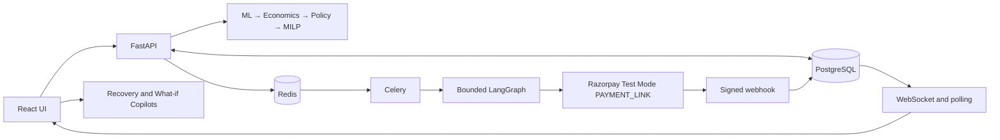

# RecoverIQ

**Portfolio-Level AI Revenue Recovery Intelligence**

RecoverIQ is a functional proof of concept that asks: **where should a merchant spend the next rupee of recovery effort?** It evaluates failed payments together, values possible interventions, enforces merchant policies, and allocates limited recovery resources across the portfolio.

> AI assists. Optimization decides. Agents execute. Outcomes close the loop.

## 1. What is RecoverIQ?

Most failed-payment decisions can be ranked independently. Merchants, however, operate with shared budgets, retry limits, customer-contact capacity, incentives, and operational constraints. RecoverIQ adds an explicit portfolio-level economics and allocation layer above payment-recovery rails.

The system separates responsibilities: ML predicts; economics converts predictions into value; deterministic policy defines eligibility; MILP allocates resources; LangGraph executes an approved assignment; Razorpay performs the supported payment-side action; webhooks persist outcomes.

## 2. Why this matters

A payment may respond to retrying, a payment link, alternate method, messaging, incentive, escalation, or no intervention. Selecting every payment's local best action can exhaust scarce resources on weak marginal opportunities. A global allocation can produce more total incremental value while remaining explainable and policy-compliant.

RecoverIQ also distinguishes an estimated recovery opportunity from an observed recovery. Creating a provider action is not a recovered payment; only a persisted provider-confirmed outcome closes the loop.

## 3. Three core innovations

### Portfolio-optimal recovery

Action-conditioned predictions feed deterministic economics, policy checks, and an OR-Tools MILP. In one local demo, payment 1202 locally preferred `INCENTIVE` but received rank-2 `RETRY_LATER`; payment 1217 received the only incentive because that allocation improved the combined objective by ₹107.49. IDs differ on fresh installations.

### Bounded closed-loop execution

An approved assignment flows through FastAPI, Redis/Celery, and LangGraph to the Razorpay Test Mode adapter. A signed webhook then updates payment, intervention, outcome, and audit state.

### Dual bounded copilots

- **What-if Copilot:** natural language → validated constraint proposal → preview → explicit confirmation → existing MILP.
- **Recovery Copilot:** persisted evidence → read-only grounded explanation.

Neither LLM has financial authority.

## 4. Architecture



See [docs/architecture.md](docs/architecture.md) for detailed diagrams and sequences.

## 5. Decision pipeline

```text
payment/customer context
→ candidate actions
→ P(recovery | context, action)
→ economics relative to DO_NOTHING
→ policy eligibility
→ portfolio optimization
→ immutable versioned plan
```

The active approximation is:

```text
incremental value =
  [P(recovery | action) - P(recovery | DO_NOTHING)] × amount
  - intervention cost
  - incentive cost
```

`DO_NOTHING` has zero incremental value and always remains feasible.

## 6. Optimization formulation

For payment `i` and eligible action `j`, the MILP creates binary `x[i,j]`. It maximizes `Σ x[i,j] × incremental_value[i,j]`, subject to exactly one action per payment, total/intervention and incentive budgets, retry capacity, contact capacity, WhatsApp capacity, incentive-action capacity, human escalation capacity, and policy/action eligibility.

Why greedy ranking is insufficient:

| Local demo example | INCENTIVE | Best fallback |
|---|---:|---:|
| Payment 1202 | ₹102.50 | RETRY_LATER ₹91.84 |
| Payment 1217 | ₹392.03 | ALTERNATE_METHOD ₹273.88 |

With one incentive, assigning it to 1217 produces ₹107.49 more combined value. Run the fixture and use the generated IDs rather than assuming these local IDs.

## 7. Synthetic data

The project includes 50,000 deterministic synthetic observations: 32,000 train, 8,000 validation, and a 10,000-row frozen held-out test split. Features include payment amount/method/failure, timing and attempts, customer transaction history, behavioral response rates, action, and simulated outcome.

Synthetic data supports system and decision-quality development; it is not Razorpay merchant data. See [docs/DEMO_DATA.md](docs/DEMO_DATA.md).

## 8. ML

The active champion path uses an action-conditioned XGBoost recovery predictor. The checked model reports test ROC-AUC 0.7049 and Brier score 0.2048 on synthetic held-out data. Calibration matters because probabilities enter economics.

Experimental action-specific T-learner/uplift code remains in the repository but is not represented as the active production model. Training uses explicit feature allow-lists. Outcome-only fields, persisted costs, and IDs are excluded.

## 9. Economics

Synthetic demo intervention-cost assumptions are: retry ₹0.30, payment link ₹0.50, alternate method ₹0.40, WhatsApp ₹0.80, email ₹0.10, incentive ₹1.00 plus 5% of amount capped at ₹500, human escalation ₹25, and do nothing ₹0. These are modeling assumptions, not Razorpay pricing.

## 10. Policy

The deterministic policy layer evaluates retry/contact limits, action eligibility, approval requirements, incentive limits, and merchant constraints. Policy evidence and rejection reasons are persisted with the plan. Optimizer eligibility does not imply provider support: only `PAYMENT_LINK` currently has a real external executor.

## 11. Async agentic execution

`POST /recovery-batches/{id}/execute` validates and persists queued work, then returns without waiting for provider completion. Celery performs the background task. LangGraph receives the persisted `planned_action`; it cannot re-decide or replace the optimizer assignment. Bounded retries handle infrastructure failures, while terminal/idempotency guards prevent duplicate work.

## 12. Razorpay integration

The implemented adapter creates Razorpay **Test Mode Payment Links** only. It persists the provider action ID and URL. The webhook endpoint verifies the raw-body signature, stores a unique provider event, queues processing, rejects replayed terminal events, and protects successful recovery from stale lower-precedence events.

See [docs/RAZORPAY_TEST_MODE.md](docs/RAZORPAY_TEST_MODE.md).

## 13. Real-time updates

After database commit, workers publish typed batch/payment invalidation events through Redis Pub/Sub to `/ws/batches/{batch_id}`. The browser refetches PostgreSQL-backed APIs. It reconnects automatically and uses bounded polling when WebSocket delivery is unavailable. PostgreSQL—not WebSocket memory—is authoritative.

## 14. Recovery Copilot

Recovery Copilot reads payment history, ranked alternatives, policy evidence, plan constraints, intervention/provider state, webhooks, and outcomes. It is read-only and never overrides a decision. Deterministic explanations remain available when the optional LLM is unavailable.

## 15. What-if Copilot

What-if Copilot converts merchant language into a strict allow-listed constraints schema. Unknown or negative values fail validation. The UI previews differences and applies nothing until **Apply & Optimize** is clicked; that invokes the existing deterministic optimizer. The LLM cannot allocate or execute actions.

## 16. Auditability

The audit trail reconstructs persisted payment context, portfolio plan and ranked alternatives, model version, economics, policy evidence, decision, intervention, provider ID/status, webhook, and outcome. Financial values use SQL numeric/Decimal types.

## 17. Tech stack

- Python 3.10, FastAPI, Pydantic v2, SQLAlchemy 2, Alembic
- PostgreSQL 16, Redis 7, Celery
- XGBoost/scikit-learn, Pandas/NumPy
- Google OR-Tools MILP
- LangGraph
- Razorpay Python SDK in Test Mode
- React 18, TypeScript, Vite, Axios, React Router, Tailwind tooling
- Optional Groq-compatible LLM endpoint for Copilots

Pinned versions are in `backend/app/requirements.txt` and `frontend/package-lock.json`.

## 18. Repository structure

```text
backend/app/       API, models, decisioning, optimizer, policies, orchestration
backend/alembic/   PostgreSQL migrations
backend/scripts/   bootstrap, fixtures, connectivity and benchmark utilities
frontend/src/      React screens, components, API clients and types
scripts/           synthetic generation, training and evaluation
data/              synthetic frozen/derived artifacts
ml/models/         checked model artifacts and metrics
artifacts/         compact machine-readable evaluation summary
docs/              architecture, demo, safety and provider guides
```

## 19. Quick start

Prerequisites: Python 3.10, Node.js/npm, Docker Compose, and Git.

### Windows PowerShell

```powershell
docker compose up -d postgres redis
py -3.10 -m venv backend\.venv
backend\.venv\Scripts\python.exe -m pip install -r backend\app\requirements.txt
Copy-Item backend\.env.example backend\.env
cd backend
.\.venv\Scripts\python.exe -m alembic upgrade head
cd ..
backend\.venv\Scripts\python.exe backend\scripts\bootstrap_demo.py --include-tradeoff
```

Start three terminals:

```powershell
cd backend; .\.venv\Scripts\python.exe -m uvicorn app.main:app --reload
cd backend; .\.venv\Scripts\python.exe -m celery -A app.celery_app:celery_app worker --loglevel=info --pool=solo
cd frontend; npm ci; npm run dev
```

### macOS/Linux

```bash
docker compose up -d postgres redis
python3.10 -m venv backend/.venv
backend/.venv/bin/python -m pip install -r backend/app/requirements.txt
cp backend/.env.example backend/.env
cd backend
.venv/bin/python -m alembic upgrade head
cd ..
backend/.venv/bin/python backend/scripts/bootstrap_demo.py --include-tradeoff
```

Start three terminals:

```bash
cd backend && .venv/bin/python -m uvicorn app.main:app --reload
cd backend && .venv/bin/python -m celery -A app.celery_app:celery_app worker --loglevel=info
cd frontend && npm ci && npm run dev
```

Edit `backend/.env` before migration if your database URL differs from the safe local Compose defaults. Core optimization does not require Razorpay or LLM credentials.

Frontend: <http://localhost:5173> · Swagger: <http://127.0.0.1:8000/docs>

## 20. Demo walkthrough

### A — portfolio trade-off

```text
backend/.venv/Scripts/python.exe backend/scripts/create_portfolio_tradeoff_demo.py
```

Load the printed Batch ID, show incentive capacity 1/1, inspect the printed target's rank-1 incentive and rank-2 selected fallback, inspect the incentive recipient, and ask Recovery Copilot why the portfolio disagreed with the local ranking.

### B — real Razorpay Test Mode recovery

```text
backend/.venv/Scripts/python.exe backend/scripts/create_payment_link_execution_demo.py
```

Load the printed fresh Batch ID, execute once, wait for `AWAITING_PAYMENT`, open the generated link, complete a Test Mode payment, observe `RECOVERED`, then inspect Audit Trail. The fixture command itself never executes or pays anything.

## 21. Testing

Tests are destructive only inside the guarded dedicated `_test` database:

```powershell
backend\.venv\Scripts\python.exe backend\scripts\prepare_test_database.py
backend\.venv\Scripts\python.exe backend\scripts\run_isolated_tests.py
cd frontend
npm ci
npm run build
```

Latest verification: **99 backend tests passed**; frontend TypeScript and production build passed (130 modules). No frontend unit-test runner is currently configured.

## 22. Evaluation results

**SYNTHETIC OFFLINE DECISION-QUALITY EVALUATION — NOT PRODUCTION RAZORPAY MERCHANT UPLIFT**

| Frozen 10,000-payment test | Synthetic fixed-rule baseline | RecoverIQ constrained |
|---|---:|---:|
| Expected net recovery | ₹12,414,072.72 | ₹12,928,146.30 |
| Expected recovery rate | 50.29% | 51.30% |
| Incremental net revenue | — | +₹514,073.58 |
| Relative improvement | — | +4.14% |

The unconstrained ML result (₹13,285,455.82) is a theoretical benchmark and may violate resource constraints. Results are estimates on deterministic synthetic data.

Evaluation command:

```text
python scripts/evaluate_strategies.py
```

This command intentionally recomputes derived artifacts; normal startup does not.

## 23. Scale benchmark

Measured local planning-only prototype benchmark:

| Payments | Total time | Solver status |
|---:|---:|---|
| 1,000 | 12.8876 s | OPTIMAL |
| 5,000 | 27.3940 s | OPTIMAL |
| 10,000 | 48.3018 s | **FEASIBLE** |

The 10,000-payment run is not claimed optimal. Hardware/environment affect timings.

## 24. Evidence boundaries

1. **Offline decision quality:** frozen synthetic held-out evaluation and estimates.
2. **System scale:** measured local prototype benchmark.
3. **Live integration:** provider-confirmed Razorpay Test Mode outcomes persisted after signed webhooks.

These evidence classes must not be conflated.

## 25. Current limitations

- Synthetic rather than merchant training data; production uplift is unverified.
- `PAYMENT_LINK` is the only live provider execution adapter.
- Other actions require real retry/messaging/operations integrations.
- Prototype local infrastructure, tenancy, rate limiting, RBAC, PII controls, compliance and observability require hardening.
- Model calibration, monitoring and drift processes need production data.
- Production effectiveness requires controlled A/B testing and merchant-specific policy review.

## 26. Production scaling and future scope

Future work may include merchant-specific models, adaptive/uplift learning, additional recovery rails and providers, horizontally scaled API/worker deployments, managed Redis/PostgreSQL, partitioning/read replicas, observability and SLAs, drift monitoring, experiments, fraud safeguards, encryption/PII controls, RBAC, and rate limits. Kubernetes and microservices are future options—not current components.

## 27. Security and safety

Secrets are environment variables and ignored by Git. Razorpay execution refuses non-Test Mode configuration. Webhooks are signature-validated and idempotent. Execution is bounded by persisted approval/policy state. LLMs cannot make financial decisions. The public example files contain placeholders only.

Review [docs/HARDCODE_AUDIT.md](docs/HARDCODE_AUDIT.md) before publishing.

## 28. API and Swagger

Swagger is available at <http://127.0.0.1:8000/docs>. Major groups include dashboard, optimization, recovery batches, interventions, audit, evaluation, Copilot, WebSocket batch streams, recovery APIs, and Razorpay webhooks.

## 29. Why RecoverIQ alongside Razorpay

RecoverIQ demonstrates a portfolio-level constrained allocation layer across recovery interventions under merchant-wide economics and resource limits. Existing payment infrastructure remains the execution rail behind bounded provider adapters: **intelligence above the rails, not instead of them.**

## 30. Closing

RecoverIQ turns failed-payment recovery from a collection of isolated actions into a constrained, explainable, closed-loop portfolio decision system.
