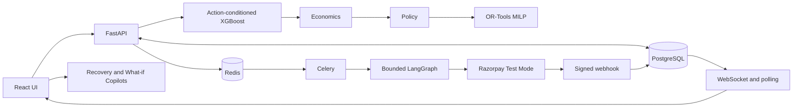
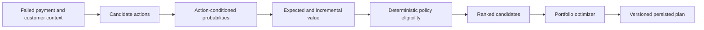
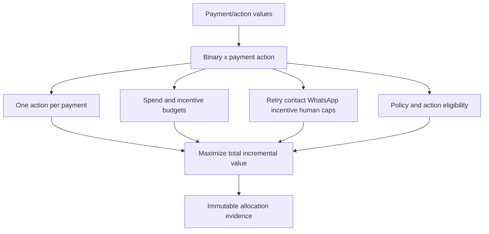
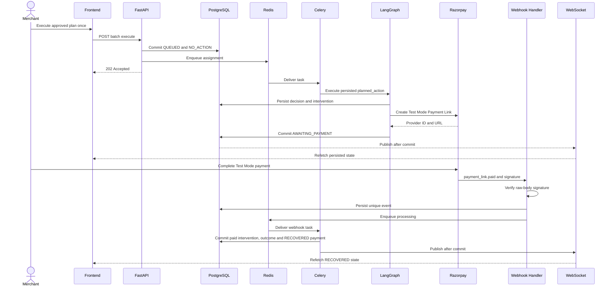
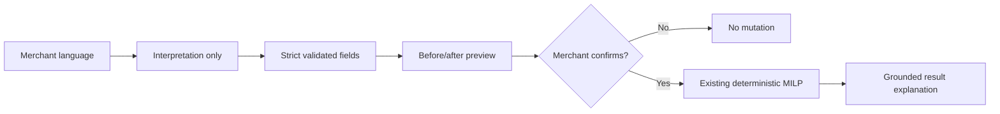
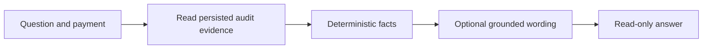
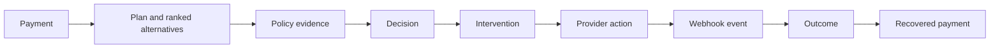

# RecoverIQ Architecture

RecoverIQ is an implemented modular monolith: React, FastAPI, PostgreSQL, Redis/Celery, bounded LangGraph orchestration, and a Razorpay Test Mode `PAYMENT_LINK` adapter.

## 1. High-level components



## 2. Prediction and decision pipeline



Outcome-only columns and identifiers are excluded by feature allow-lists. `DO_NOTHING` is the control and always remains feasible.

## 3. Optimization



The LLM and LangGraph never select `x`. OR-Tools receives policy-eligible, economically valued candidates.

## 4. Async execution

```mermaid
flowchart LR
  APPROVE[Execute approved plan] --> API[FastAPI validates READY]
  API --> DB[Commit queued assignments]
  DB --> BROKER[Redis Celery broker]
  BROKER --> WORKER[Celery]
  WORKER --> GRAPH[LangGraph planned_action]
  GRAPH --> DECISION[Persist or reuse decision]
  DECISION --> INT[Persist or reuse intervention]
  INT --> ADAPTER[PAYMENT_LINK adapter]
  ADAPTER --> WAIT[AWAITING_PAYMENT]
```



Unsupported rails become manual/no-action states. LangGraph rejects execution without a persisted optimizer assignment.

## 5. Razorpay Payment Link sequence



Provider action creation is not recovery. Only the verified provider outcome closes the loop.

## 6. WebSocket and polling

```mermaid
flowchart TD
  COMMIT[Committed PostgreSQL state] --> PUB[Best-effort Redis Pub/Sub]
  PUB --> WS[/ws/batches/{batch_id}]
  WS --> FETCH[Refetch batch summary and rows]
  FAIL{Socket connected?} -->|No| POLL[3-second fallback polling]
  FAIL -->|Yes| RECON[15-second reconciliation]
  POLL --> FETCH
  RECON --> FETCH
  FETCH --> TERM{Relevant work terminal?}
  TERM -->|Yes| STOP[Stop polling]
  TERM -->|No| FAIL
```

Events are invalidation hints. PostgreSQL is authoritative, and request sequencing prevents stale responses replacing newer state.

## 7. What-if Copilot



Invalid or unknown fields are rejected. LLM failure never invents constraints.

## 8. Recovery Copilot



The Copilot has no write or execution authority.

## 9. Audit lifecycle



Financial values use SQL numeric/Decimal. Audit responses distinguish estimates from provider-confirmed outcomes.

## Current and future scope

Current infrastructure is a local/prototype modular monolith. Managed horizontal deployment, stronger multi-tenant isolation/RBAC, observability, partitioning, rate limits, drift monitoring, controlled experiments, and additional provider adapters are future work. Kubernetes, Kafka, microservices, and non-Payment-Link provider executors are not current components.
